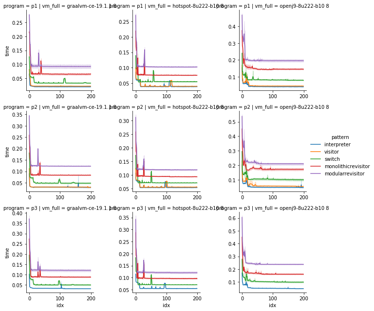
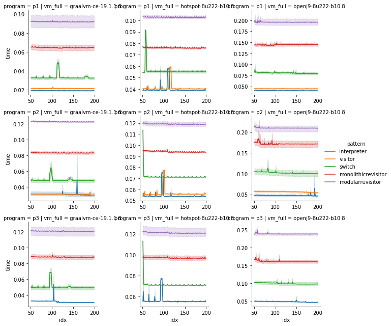
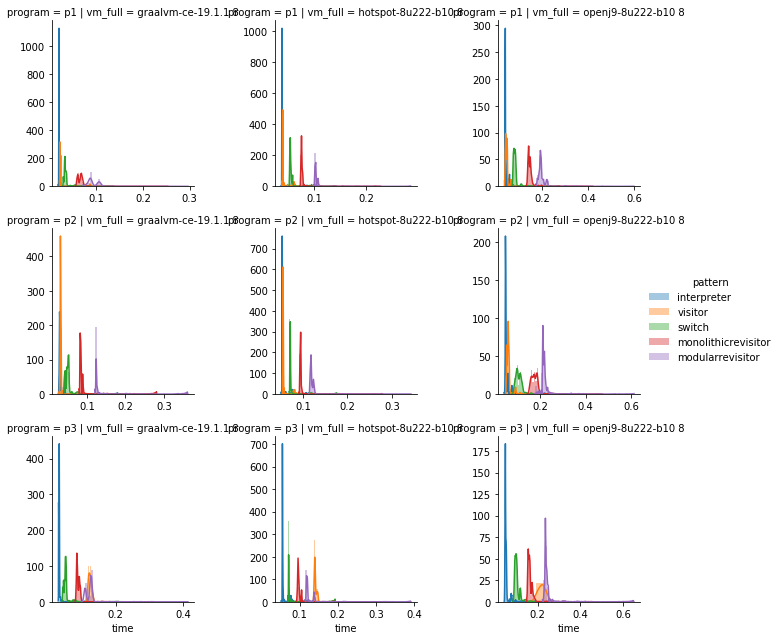
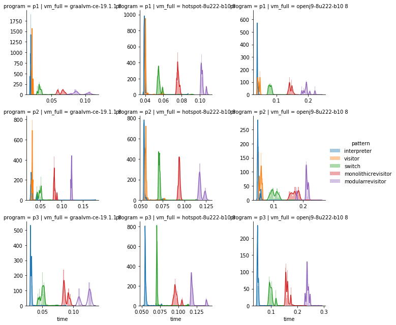
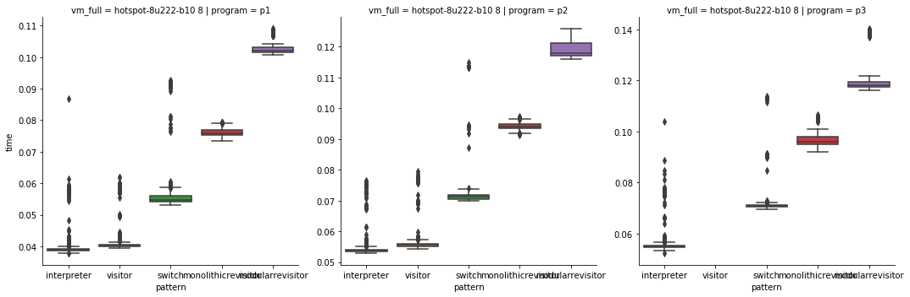
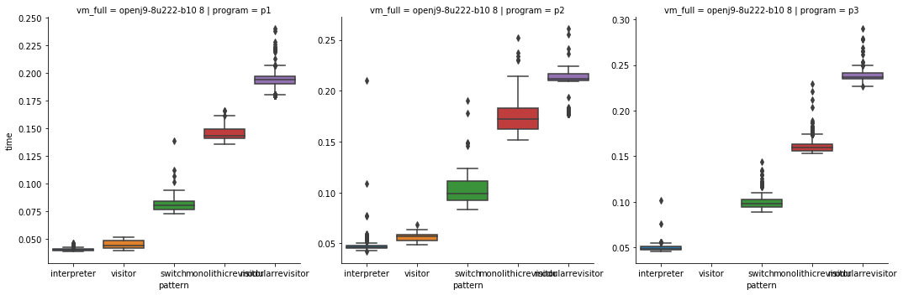
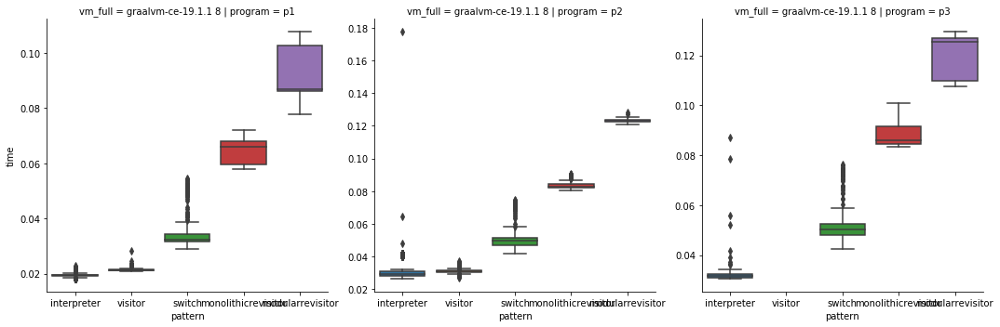

```python
from os import listdir
from os.path import isfile, join
import math
import pandas as pd
import json
import numpy as np
import seaborn as sns
import matplotlib.pyplot as plt
```


```python
root_dir = './results'
```


```python
results=[]
for f in listdir(root_dir):
    path = join(root_dir, f)
    if isfile(path):
        #print(path)
        fo = open(path)
        jso = json.loads(fo.read())
        
        splt = f.split('_')
        vm = splt[2]
        vm_version = 8
        timestamp = splt[-1][:-5]
        pattern = splt[1]
        program = splt[0]
        language = 'activity diagram'
        if len(jso) > 0:
            for (idx, time) in enumerate(jso[0]['primaryMetric']['rawData'][0]):
                    results.append({
                            'vm': vm,
                            'vm_version': str(vm_version),
                            'vm_full': vm + ' ' + str(vm_version),
                            'pattern': pattern,
                            'program': program,
                            'language': language,
                            'timestamp': timestamp,
                            'time': time,
                            'idx': idx
                    })
        else:
            print(path, 'EMPTY')

df = pd.DataFrame(results)

df['pattern_order'] = df['pattern'].map({
    'interpreter': 0,
    'visitor': 1,
    'switch': 2,
    'monolithicrevisitor': 3,
    'modularrevisitor': 4,
})

df = df.sort_values(by=['pattern_order', 'vm_full', 'program'])

df.describe(include='all')
```


<div>
<style scoped>
    .dataframe tbody tr th:only-of-type {
        vertical-align: middle;
    }

    .dataframe tbody tr th {
        vertical-align: top;
    }

    .dataframe thead th {
        text-align: right;
    }
</style>
<table border="1" class="dataframe">
  <thead>
    <tr style="text-align: right;">
      <th></th>
      <th>vm</th>
      <th>vm_version</th>
      <th>vm_full</th>
      <th>pattern</th>
      <th>program</th>
      <th>language</th>
      <th>timestamp</th>
      <th>time</th>
      <th>idx</th>
      <th>pattern_order</th>
    </tr>
  </thead>
  <tbody>
    <tr>
      <th>count</th>
      <td>71025</td>
      <td>71025</td>
      <td>71025</td>
      <td>71025</td>
      <td>71025</td>
      <td>71025</td>
      <td>71025</td>
      <td>71025.000000</td>
      <td>71025.000000</td>
      <td>71025.000000</td>
    </tr>
    <tr>
      <th>unique</th>
      <td>3</td>
      <td>1</td>
      <td>3</td>
      <td>5</td>
      <td>3</td>
      <td>1</td>
      <td>380</td>
      <td>NaN</td>
      <td>NaN</td>
      <td>NaN</td>
    </tr>
    <tr>
      <th>top</th>
      <td>openj9-8u222-b10</td>
      <td>8</td>
      <td>openj9-8u222-b10 8</td>
      <td>modularrevisitor</td>
      <td>p2</td>
      <td>activity diagram</td>
      <td>1568120394914</td>
      <td>NaN</td>
      <td>NaN</td>
      <td>NaN</td>
    </tr>
    <tr>
      <th>freq</th>
      <td>24608</td>
      <td>71025</td>
      <td>24608</td>
      <td>15600</td>
      <td>25400</td>
      <td>71025</td>
      <td>200</td>
      <td>NaN</td>
      <td>NaN</td>
      <td>NaN</td>
    </tr>
    <tr>
      <th>mean</th>
      <td>NaN</td>
      <td>NaN</td>
      <td>NaN</td>
      <td>NaN</td>
      <td>NaN</td>
      <td>NaN</td>
      <td>NaN</td>
      <td>0.088281</td>
      <td>99.464977</td>
      <td>2.081309</td>
    </tr>
    <tr>
      <th>std</th>
      <td>NaN</td>
      <td>NaN</td>
      <td>NaN</td>
      <td>NaN</td>
      <td>NaN</td>
      <td>NaN</td>
      <td>NaN</td>
      <td>0.057218</td>
      <td>57.754716</td>
      <td>1.440391</td>
    </tr>
    <tr>
      <th>min</th>
      <td>NaN</td>
      <td>NaN</td>
      <td>NaN</td>
      <td>NaN</td>
      <td>NaN</td>
      <td>NaN</td>
      <td>NaN</td>
      <td>0.018020</td>
      <td>0.000000</td>
      <td>0.000000</td>
    </tr>
    <tr>
      <th>25%</th>
      <td>NaN</td>
      <td>NaN</td>
      <td>NaN</td>
      <td>NaN</td>
      <td>NaN</td>
      <td>NaN</td>
      <td>NaN</td>
      <td>0.047808</td>
      <td>49.000000</td>
      <td>1.000000</td>
    </tr>
    <tr>
      <th>50%</th>
      <td>NaN</td>
      <td>NaN</td>
      <td>NaN</td>
      <td>NaN</td>
      <td>NaN</td>
      <td>NaN</td>
      <td>NaN</td>
      <td>0.074816</td>
      <td>99.000000</td>
      <td>2.000000</td>
    </tr>
    <tr>
      <th>75%</th>
      <td>NaN</td>
      <td>NaN</td>
      <td>NaN</td>
      <td>NaN</td>
      <td>NaN</td>
      <td>NaN</td>
      <td>NaN</td>
      <td>0.116439</td>
      <td>149.000000</td>
      <td>3.000000</td>
    </tr>
    <tr>
      <th>max</th>
      <td>NaN</td>
      <td>NaN</td>
      <td>NaN</td>
      <td>NaN</td>
      <td>NaN</td>
      <td>NaN</td>
      <td>NaN</td>
      <td>0.647862</td>
      <td>199.000000</td>
      <td>4.000000</td>
    </tr>
  </tbody>
</table>
</div>


```python
nwp = df[df['idx']>50]

nwp.loc[nwp.pattern == 'revisitor', 'pattern'] = 'visitor'
#print(nwp.pattern.unique())
#print(nwp.pattern_order.unique())
nwp = nwp.sort_values(by=['pattern_order', 'vm_full', 'program'])
nwp
```

    /home/manuel/.local/lib/python3.7/site-packages/pandas/core/indexing.py:480: SettingWithCopyWarning: 
    A value is trying to be set on a copy of a slice from a DataFrame.
    Try using .loc[row_indexer,col_indexer] = value instead
    
    See the caveats in the documentation: http://pandas.pydata.org/pandas-docs/stable/user_guide/indexing.html#returning-a-view-versus-a-copy
      self.obj[item] = s


<div>
<style scoped>
    .dataframe tbody tr th:only-of-type {
        vertical-align: middle;
    }

    .dataframe tbody tr th {
        vertical-align: top;
    }

    .dataframe thead th {
        text-align: right;
    }
</style>
<table border="1" class="dataframe">
  <thead>
    <tr style="text-align: right;">
      <th></th>
      <th>vm</th>
      <th>vm_version</th>
      <th>vm_full</th>
      <th>pattern</th>
      <th>program</th>
      <th>language</th>
      <th>timestamp</th>
      <th>time</th>
      <th>idx</th>
      <th>pattern_order</th>
    </tr>
  </thead>
  <tbody>
    <tr>
      <th>19260</th>
      <td>graalvm-ce-19.1.1</td>
      <td>8</td>
      <td>graalvm-ce-19.1.1 8</td>
      <td>interpreter</td>
      <td>p1</td>
      <td>activity diagram</td>
      <td>1568120609219</td>
      <td>0.019667</td>
      <td>51</td>
      <td>0</td>
    </tr>
    <tr>
      <th>19261</th>
      <td>graalvm-ce-19.1.1</td>
      <td>8</td>
      <td>graalvm-ce-19.1.1 8</td>
      <td>interpreter</td>
      <td>p1</td>
      <td>activity diagram</td>
      <td>1568120609219</td>
      <td>0.019681</td>
      <td>52</td>
      <td>0</td>
    </tr>
    <tr>
      <th>19262</th>
      <td>graalvm-ce-19.1.1</td>
      <td>8</td>
      <td>graalvm-ce-19.1.1 8</td>
      <td>interpreter</td>
      <td>p1</td>
      <td>activity diagram</td>
      <td>1568120609219</td>
      <td>0.019787</td>
      <td>53</td>
      <td>0</td>
    </tr>
    <tr>
      <th>19263</th>
      <td>graalvm-ce-19.1.1</td>
      <td>8</td>
      <td>graalvm-ce-19.1.1 8</td>
      <td>interpreter</td>
      <td>p1</td>
      <td>activity diagram</td>
      <td>1568120609219</td>
      <td>0.019824</td>
      <td>54</td>
      <td>0</td>
    </tr>
    <tr>
      <th>19264</th>
      <td>graalvm-ce-19.1.1</td>
      <td>8</td>
      <td>graalvm-ce-19.1.1 8</td>
      <td>interpreter</td>
      <td>p1</td>
      <td>activity diagram</td>
      <td>1568120609219</td>
      <td>0.019678</td>
      <td>55</td>
      <td>0</td>
    </tr>
    <tr>
      <th>19265</th>
      <td>graalvm-ce-19.1.1</td>
      <td>8</td>
      <td>graalvm-ce-19.1.1 8</td>
      <td>interpreter</td>
      <td>p1</td>
      <td>activity diagram</td>
      <td>1568120609219</td>
      <td>0.019855</td>
      <td>56</td>
      <td>0</td>
    </tr>
    <tr>
      <th>19266</th>
      <td>graalvm-ce-19.1.1</td>
      <td>8</td>
      <td>graalvm-ce-19.1.1 8</td>
      <td>interpreter</td>
      <td>p1</td>
      <td>activity diagram</td>
      <td>1568120609219</td>
      <td>0.019656</td>
      <td>57</td>
      <td>0</td>
    </tr>
    <tr>
      <th>19267</th>
      <td>graalvm-ce-19.1.1</td>
      <td>8</td>
      <td>graalvm-ce-19.1.1 8</td>
      <td>interpreter</td>
      <td>p1</td>
      <td>activity diagram</td>
      <td>1568120609219</td>
      <td>0.019740</td>
      <td>58</td>
      <td>0</td>
    </tr>
    <tr>
      <th>19268</th>
      <td>graalvm-ce-19.1.1</td>
      <td>8</td>
      <td>graalvm-ce-19.1.1 8</td>
      <td>interpreter</td>
      <td>p1</td>
      <td>activity diagram</td>
      <td>1568120609219</td>
      <td>0.019676</td>
      <td>59</td>
      <td>0</td>
    </tr>
    <tr>
      <th>19269</th>
      <td>graalvm-ce-19.1.1</td>
      <td>8</td>
      <td>graalvm-ce-19.1.1 8</td>
      <td>interpreter</td>
      <td>p1</td>
      <td>activity diagram</td>
      <td>1568120609219</td>
      <td>0.019698</td>
      <td>60</td>
      <td>0</td>
    </tr>
    <tr>
      <th>19270</th>
      <td>graalvm-ce-19.1.1</td>
      <td>8</td>
      <td>graalvm-ce-19.1.1 8</td>
      <td>interpreter</td>
      <td>p1</td>
      <td>activity diagram</td>
      <td>1568120609219</td>
      <td>0.019830</td>
      <td>61</td>
      <td>0</td>
    </tr>
    <tr>
      <th>19271</th>
      <td>graalvm-ce-19.1.1</td>
      <td>8</td>
      <td>graalvm-ce-19.1.1 8</td>
      <td>interpreter</td>
      <td>p1</td>
      <td>activity diagram</td>
      <td>1568120609219</td>
      <td>0.019616</td>
      <td>62</td>
      <td>0</td>
    </tr>
    <tr>
      <th>19272</th>
      <td>graalvm-ce-19.1.1</td>
      <td>8</td>
      <td>graalvm-ce-19.1.1 8</td>
      <td>interpreter</td>
      <td>p1</td>
      <td>activity diagram</td>
      <td>1568120609219</td>
      <td>0.019546</td>
      <td>63</td>
      <td>0</td>
    </tr>
    <tr>
      <th>19273</th>
      <td>graalvm-ce-19.1.1</td>
      <td>8</td>
      <td>graalvm-ce-19.1.1 8</td>
      <td>interpreter</td>
      <td>p1</td>
      <td>activity diagram</td>
      <td>1568120609219</td>
      <td>0.019552</td>
      <td>64</td>
      <td>0</td>
    </tr>
    <tr>
      <th>19274</th>
      <td>graalvm-ce-19.1.1</td>
      <td>8</td>
      <td>graalvm-ce-19.1.1 8</td>
      <td>interpreter</td>
      <td>p1</td>
      <td>activity diagram</td>
      <td>1568120609219</td>
      <td>0.019601</td>
      <td>65</td>
      <td>0</td>
    </tr>
    <tr>
      <th>19275</th>
      <td>graalvm-ce-19.1.1</td>
      <td>8</td>
      <td>graalvm-ce-19.1.1 8</td>
      <td>interpreter</td>
      <td>p1</td>
      <td>activity diagram</td>
      <td>1568120609219</td>
      <td>0.019477</td>
      <td>66</td>
      <td>0</td>
    </tr>
    <tr>
      <th>19276</th>
      <td>graalvm-ce-19.1.1</td>
      <td>8</td>
      <td>graalvm-ce-19.1.1 8</td>
      <td>interpreter</td>
      <td>p1</td>
      <td>activity diagram</td>
      <td>1568120609219</td>
      <td>0.019534</td>
      <td>67</td>
      <td>0</td>
    </tr>
    <tr>
      <th>19277</th>
      <td>graalvm-ce-19.1.1</td>
      <td>8</td>
      <td>graalvm-ce-19.1.1 8</td>
      <td>interpreter</td>
      <td>p1</td>
      <td>activity diagram</td>
      <td>1568120609219</td>
      <td>0.019617</td>
      <td>68</td>
      <td>0</td>
    </tr>
    <tr>
      <th>19278</th>
      <td>graalvm-ce-19.1.1</td>
      <td>8</td>
      <td>graalvm-ce-19.1.1 8</td>
      <td>interpreter</td>
      <td>p1</td>
      <td>activity diagram</td>
      <td>1568120609219</td>
      <td>0.019609</td>
      <td>69</td>
      <td>0</td>
    </tr>
    <tr>
      <th>19279</th>
      <td>graalvm-ce-19.1.1</td>
      <td>8</td>
      <td>graalvm-ce-19.1.1 8</td>
      <td>interpreter</td>
      <td>p1</td>
      <td>activity diagram</td>
      <td>1568120609219</td>
      <td>0.019618</td>
      <td>70</td>
      <td>0</td>
    </tr>
    <tr>
      <th>19280</th>
      <td>graalvm-ce-19.1.1</td>
      <td>8</td>
      <td>graalvm-ce-19.1.1 8</td>
      <td>interpreter</td>
      <td>p1</td>
      <td>activity diagram</td>
      <td>1568120609219</td>
      <td>0.019489</td>
      <td>71</td>
      <td>0</td>
    </tr>
    <tr>
      <th>19281</th>
      <td>graalvm-ce-19.1.1</td>
      <td>8</td>
      <td>graalvm-ce-19.1.1 8</td>
      <td>interpreter</td>
      <td>p1</td>
      <td>activity diagram</td>
      <td>1568120609219</td>
      <td>0.019588</td>
      <td>72</td>
      <td>0</td>
    </tr>
    <tr>
      <th>19282</th>
      <td>graalvm-ce-19.1.1</td>
      <td>8</td>
      <td>graalvm-ce-19.1.1 8</td>
      <td>interpreter</td>
      <td>p1</td>
      <td>activity diagram</td>
      <td>1568120609219</td>
      <td>0.019512</td>
      <td>73</td>
      <td>0</td>
    </tr>
    <tr>
      <th>19283</th>
      <td>graalvm-ce-19.1.1</td>
      <td>8</td>
      <td>graalvm-ce-19.1.1 8</td>
      <td>interpreter</td>
      <td>p1</td>
      <td>activity diagram</td>
      <td>1568120609219</td>
      <td>0.019661</td>
      <td>74</td>
      <td>0</td>
    </tr>
    <tr>
      <th>19284</th>
      <td>graalvm-ce-19.1.1</td>
      <td>8</td>
      <td>graalvm-ce-19.1.1 8</td>
      <td>interpreter</td>
      <td>p1</td>
      <td>activity diagram</td>
      <td>1568120609219</td>
      <td>0.019461</td>
      <td>75</td>
      <td>0</td>
    </tr>
    <tr>
      <th>19285</th>
      <td>graalvm-ce-19.1.1</td>
      <td>8</td>
      <td>graalvm-ce-19.1.1 8</td>
      <td>interpreter</td>
      <td>p1</td>
      <td>activity diagram</td>
      <td>1568120609219</td>
      <td>0.019645</td>
      <td>76</td>
      <td>0</td>
    </tr>
    <tr>
      <th>19286</th>
      <td>graalvm-ce-19.1.1</td>
      <td>8</td>
      <td>graalvm-ce-19.1.1 8</td>
      <td>interpreter</td>
      <td>p1</td>
      <td>activity diagram</td>
      <td>1568120609219</td>
      <td>0.019587</td>
      <td>77</td>
      <td>0</td>
    </tr>
    <tr>
      <th>19287</th>
      <td>graalvm-ce-19.1.1</td>
      <td>8</td>
      <td>graalvm-ce-19.1.1 8</td>
      <td>interpreter</td>
      <td>p1</td>
      <td>activity diagram</td>
      <td>1568120609219</td>
      <td>0.019495</td>
      <td>78</td>
      <td>0</td>
    </tr>
    <tr>
      <th>19288</th>
      <td>graalvm-ce-19.1.1</td>
      <td>8</td>
      <td>graalvm-ce-19.1.1 8</td>
      <td>interpreter</td>
      <td>p1</td>
      <td>activity diagram</td>
      <td>1568120609219</td>
      <td>0.019640</td>
      <td>79</td>
      <td>0</td>
    </tr>
    <tr>
      <th>19289</th>
      <td>graalvm-ce-19.1.1</td>
      <td>8</td>
      <td>graalvm-ce-19.1.1 8</td>
      <td>interpreter</td>
      <td>p1</td>
      <td>activity diagram</td>
      <td>1568120609219</td>
      <td>0.019520</td>
      <td>80</td>
      <td>0</td>
    </tr>
    <tr>
      <th>...</th>
      <td>...</td>
      <td>...</td>
      <td>...</td>
      <td>...</td>
      <td>...</td>
      <td>...</td>
      <td>...</td>
      <td>...</td>
      <td>...</td>
      <td>...</td>
    </tr>
    <tr>
      <th>50190</th>
      <td>openj9-8u222-b10</td>
      <td>8</td>
      <td>openj9-8u222-b10 8</td>
      <td>modularrevisitor</td>
      <td>p3</td>
      <td>activity diagram</td>
      <td>1568137709630</td>
      <td>0.240548</td>
      <td>170</td>
      <td>4</td>
    </tr>
    <tr>
      <th>50191</th>
      <td>openj9-8u222-b10</td>
      <td>8</td>
      <td>openj9-8u222-b10 8</td>
      <td>modularrevisitor</td>
      <td>p3</td>
      <td>activity diagram</td>
      <td>1568137709630</td>
      <td>0.240663</td>
      <td>171</td>
      <td>4</td>
    </tr>
    <tr>
      <th>50192</th>
      <td>openj9-8u222-b10</td>
      <td>8</td>
      <td>openj9-8u222-b10 8</td>
      <td>modularrevisitor</td>
      <td>p3</td>
      <td>activity diagram</td>
      <td>1568137709630</td>
      <td>0.240038</td>
      <td>172</td>
      <td>4</td>
    </tr>
    <tr>
      <th>50193</th>
      <td>openj9-8u222-b10</td>
      <td>8</td>
      <td>openj9-8u222-b10 8</td>
      <td>modularrevisitor</td>
      <td>p3</td>
      <td>activity diagram</td>
      <td>1568137709630</td>
      <td>0.240103</td>
      <td>173</td>
      <td>4</td>
    </tr>
    <tr>
      <th>50194</th>
      <td>openj9-8u222-b10</td>
      <td>8</td>
      <td>openj9-8u222-b10 8</td>
      <td>modularrevisitor</td>
      <td>p3</td>
      <td>activity diagram</td>
      <td>1568137709630</td>
      <td>0.241042</td>
      <td>174</td>
      <td>4</td>
    </tr>
    <tr>
      <th>50195</th>
      <td>openj9-8u222-b10</td>
      <td>8</td>
      <td>openj9-8u222-b10 8</td>
      <td>modularrevisitor</td>
      <td>p3</td>
      <td>activity diagram</td>
      <td>1568137709630</td>
      <td>0.240290</td>
      <td>175</td>
      <td>4</td>
    </tr>
    <tr>
      <th>50196</th>
      <td>openj9-8u222-b10</td>
      <td>8</td>
      <td>openj9-8u222-b10 8</td>
      <td>modularrevisitor</td>
      <td>p3</td>
      <td>activity diagram</td>
      <td>1568137709630</td>
      <td>0.239899</td>
      <td>176</td>
      <td>4</td>
    </tr>
    <tr>
      <th>50197</th>
      <td>openj9-8u222-b10</td>
      <td>8</td>
      <td>openj9-8u222-b10 8</td>
      <td>modularrevisitor</td>
      <td>p3</td>
      <td>activity diagram</td>
      <td>1568137709630</td>
      <td>0.240979</td>
      <td>177</td>
      <td>4</td>
    </tr>
    <tr>
      <th>50198</th>
      <td>openj9-8u222-b10</td>
      <td>8</td>
      <td>openj9-8u222-b10 8</td>
      <td>modularrevisitor</td>
      <td>p3</td>
      <td>activity diagram</td>
      <td>1568137709630</td>
      <td>0.240080</td>
      <td>178</td>
      <td>4</td>
    </tr>
    <tr>
      <th>50199</th>
      <td>openj9-8u222-b10</td>
      <td>8</td>
      <td>openj9-8u222-b10 8</td>
      <td>modularrevisitor</td>
      <td>p3</td>
      <td>activity diagram</td>
      <td>1568137709630</td>
      <td>0.240279</td>
      <td>179</td>
      <td>4</td>
    </tr>
    <tr>
      <th>50200</th>
      <td>openj9-8u222-b10</td>
      <td>8</td>
      <td>openj9-8u222-b10 8</td>
      <td>modularrevisitor</td>
      <td>p3</td>
      <td>activity diagram</td>
      <td>1568137709630</td>
      <td>0.240500</td>
      <td>180</td>
      <td>4</td>
    </tr>
    <tr>
      <th>50201</th>
      <td>openj9-8u222-b10</td>
      <td>8</td>
      <td>openj9-8u222-b10 8</td>
      <td>modularrevisitor</td>
      <td>p3</td>
      <td>activity diagram</td>
      <td>1568137709630</td>
      <td>0.240615</td>
      <td>181</td>
      <td>4</td>
    </tr>
    <tr>
      <th>50202</th>
      <td>openj9-8u222-b10</td>
      <td>8</td>
      <td>openj9-8u222-b10 8</td>
      <td>modularrevisitor</td>
      <td>p3</td>
      <td>activity diagram</td>
      <td>1568137709630</td>
      <td>0.240138</td>
      <td>182</td>
      <td>4</td>
    </tr>
    <tr>
      <th>50203</th>
      <td>openj9-8u222-b10</td>
      <td>8</td>
      <td>openj9-8u222-b10 8</td>
      <td>modularrevisitor</td>
      <td>p3</td>
      <td>activity diagram</td>
      <td>1568137709630</td>
      <td>0.240202</td>
      <td>183</td>
      <td>4</td>
    </tr>
    <tr>
      <th>50204</th>
      <td>openj9-8u222-b10</td>
      <td>8</td>
      <td>openj9-8u222-b10 8</td>
      <td>modularrevisitor</td>
      <td>p3</td>
      <td>activity diagram</td>
      <td>1568137709630</td>
      <td>0.240753</td>
      <td>184</td>
      <td>4</td>
    </tr>
    <tr>
      <th>50205</th>
      <td>openj9-8u222-b10</td>
      <td>8</td>
      <td>openj9-8u222-b10 8</td>
      <td>modularrevisitor</td>
      <td>p3</td>
      <td>activity diagram</td>
      <td>1568137709630</td>
      <td>0.240873</td>
      <td>185</td>
      <td>4</td>
    </tr>
    <tr>
      <th>50206</th>
      <td>openj9-8u222-b10</td>
      <td>8</td>
      <td>openj9-8u222-b10 8</td>
      <td>modularrevisitor</td>
      <td>p3</td>
      <td>activity diagram</td>
      <td>1568137709630</td>
      <td>0.239874</td>
      <td>186</td>
      <td>4</td>
    </tr>
    <tr>
      <th>50207</th>
      <td>openj9-8u222-b10</td>
      <td>8</td>
      <td>openj9-8u222-b10 8</td>
      <td>modularrevisitor</td>
      <td>p3</td>
      <td>activity diagram</td>
      <td>1568137709630</td>
      <td>0.240102</td>
      <td>187</td>
      <td>4</td>
    </tr>
    <tr>
      <th>50208</th>
      <td>openj9-8u222-b10</td>
      <td>8</td>
      <td>openj9-8u222-b10 8</td>
      <td>modularrevisitor</td>
      <td>p3</td>
      <td>activity diagram</td>
      <td>1568137709630</td>
      <td>0.241210</td>
      <td>188</td>
      <td>4</td>
    </tr>
    <tr>
      <th>50209</th>
      <td>openj9-8u222-b10</td>
      <td>8</td>
      <td>openj9-8u222-b10 8</td>
      <td>modularrevisitor</td>
      <td>p3</td>
      <td>activity diagram</td>
      <td>1568137709630</td>
      <td>0.240971</td>
      <td>189</td>
      <td>4</td>
    </tr>
    <tr>
      <th>50210</th>
      <td>openj9-8u222-b10</td>
      <td>8</td>
      <td>openj9-8u222-b10 8</td>
      <td>modularrevisitor</td>
      <td>p3</td>
      <td>activity diagram</td>
      <td>1568137709630</td>
      <td>0.240740</td>
      <td>190</td>
      <td>4</td>
    </tr>
    <tr>
      <th>50211</th>
      <td>openj9-8u222-b10</td>
      <td>8</td>
      <td>openj9-8u222-b10 8</td>
      <td>modularrevisitor</td>
      <td>p3</td>
      <td>activity diagram</td>
      <td>1568137709630</td>
      <td>0.240473</td>
      <td>191</td>
      <td>4</td>
    </tr>
    <tr>
      <th>50212</th>
      <td>openj9-8u222-b10</td>
      <td>8</td>
      <td>openj9-8u222-b10 8</td>
      <td>modularrevisitor</td>
      <td>p3</td>
      <td>activity diagram</td>
      <td>1568137709630</td>
      <td>0.240545</td>
      <td>192</td>
      <td>4</td>
    </tr>
    <tr>
      <th>50213</th>
      <td>openj9-8u222-b10</td>
      <td>8</td>
      <td>openj9-8u222-b10 8</td>
      <td>modularrevisitor</td>
      <td>p3</td>
      <td>activity diagram</td>
      <td>1568137709630</td>
      <td>0.240359</td>
      <td>193</td>
      <td>4</td>
    </tr>
    <tr>
      <th>50214</th>
      <td>openj9-8u222-b10</td>
      <td>8</td>
      <td>openj9-8u222-b10 8</td>
      <td>modularrevisitor</td>
      <td>p3</td>
      <td>activity diagram</td>
      <td>1568137709630</td>
      <td>0.240692</td>
      <td>194</td>
      <td>4</td>
    </tr>
    <tr>
      <th>50215</th>
      <td>openj9-8u222-b10</td>
      <td>8</td>
      <td>openj9-8u222-b10 8</td>
      <td>modularrevisitor</td>
      <td>p3</td>
      <td>activity diagram</td>
      <td>1568137709630</td>
      <td>0.240236</td>
      <td>195</td>
      <td>4</td>
    </tr>
    <tr>
      <th>50216</th>
      <td>openj9-8u222-b10</td>
      <td>8</td>
      <td>openj9-8u222-b10 8</td>
      <td>modularrevisitor</td>
      <td>p3</td>
      <td>activity diagram</td>
      <td>1568137709630</td>
      <td>0.240473</td>
      <td>196</td>
      <td>4</td>
    </tr>
    <tr>
      <th>50217</th>
      <td>openj9-8u222-b10</td>
      <td>8</td>
      <td>openj9-8u222-b10 8</td>
      <td>modularrevisitor</td>
      <td>p3</td>
      <td>activity diagram</td>
      <td>1568137709630</td>
      <td>0.239681</td>
      <td>197</td>
      <td>4</td>
    </tr>
    <tr>
      <th>50218</th>
      <td>openj9-8u222-b10</td>
      <td>8</td>
      <td>openj9-8u222-b10 8</td>
      <td>modularrevisitor</td>
      <td>p3</td>
      <td>activity diagram</td>
      <td>1568137709630</td>
      <td>0.241373</td>
      <td>198</td>
      <td>4</td>
    </tr>
    <tr>
      <th>50219</th>
      <td>openj9-8u222-b10</td>
      <td>8</td>
      <td>openj9-8u222-b10 8</td>
      <td>modularrevisitor</td>
      <td>p3</td>
      <td>activity diagram</td>
      <td>1568137709630</td>
      <td>0.240238</td>
      <td>199</td>
      <td>4</td>
    </tr>
  </tbody>
</table>
<p>52895 rows × 10 columns</p>
</div>


```python
nb_docs=42

variances = pd.DataFrame(nwp.groupby(["program", "vm_full", "pattern"]).time.var())
variances["program"] = ""
variances["vm_full"] = ""
variances["pattern"] = ""
variances.program = variances.index.get_level_values(0)
variances.vm_full = variances.index.get_level_values(1)
variances.pattern = variances.index.get_level_values(2)
variances.index = range(nb_docs)
variances.rename(columns={"time":"Variance"}, inplace=True)

deviations = pd.DataFrame(nwp.groupby(["program", "vm_full", "pattern"]).time.std())
deviations["program"] = ""
deviations["vm_full"] = ""
deviations["pattern"] = ""
deviations.program = deviations.index.get_level_values(0)
deviations.vm_full = deviations.index.get_level_values(1)
deviations.pattern = deviations.index.get_level_values(2)
deviations.index = range(nb_docs)
deviations.rename(columns={"time":"Deviation"}, inplace=True)

means = pd.DataFrame(nwp.groupby(["program", "vm_full", "pattern"]).time.mean())
means["program"] = ""
means["vm_full"] = ""
means["pattern"] = ""
means.program = means.index.get_level_values(0)
means.vm_full = means.index.get_level_values(1)
means.pattern = means.index.get_level_values(2)
means.index = range(nb_docs)
means.rename(columns={"time":"Mean"}, inplace=True)

medians = pd.DataFrame(nwp.groupby(["program", "vm_full", "pattern"]).time.median())
medians["program"] = ""
medians["vm_full"] = ""
medians["pattern"] = ""
medians.program = medians.index.get_level_values(0)
medians.vm_full = medians.index.get_level_values(1)
medians.pattern = medians.index.get_level_values(2)
medians.index = range(nb_docs)
medians.rename(columns={"time":"Median"}, inplace=True)

stats = pd.concat([means, medians, deviations, variances], axis=1)
stats = stats.loc[:,~stats.columns.duplicated()]
stats.sort_values(by=['vm_full', 'pattern', 'program'])
```


<div>
<style scoped>
    .dataframe tbody tr th:only-of-type {
        vertical-align: middle;
    }

    .dataframe tbody tr th {
        vertical-align: top;
    }

    .dataframe thead th {
        text-align: right;
    }
</style>
<table border="1" class="dataframe">
  <thead>
    <tr style="text-align: right;">
      <th></th>
      <th>Mean</th>
      <th>program</th>
      <th>vm_full</th>
      <th>pattern</th>
      <th>Median</th>
      <th>Deviation</th>
      <th>Variance</th>
    </tr>
  </thead>
  <tbody>
    <tr>
      <th>0</th>
      <td>0.019246</td>
      <td>p1</td>
      <td>graalvm-ce-19.1.1 8</td>
      <td>interpreter</td>
      <td>0.019392</td>
      <td>0.000547</td>
      <td>2.987650e-07</td>
    </tr>
    <tr>
      <th>15</th>
      <td>0.030934</td>
      <td>p2</td>
      <td>graalvm-ce-19.1.1 8</td>
      <td>interpreter</td>
      <td>0.029307</td>
      <td>0.006019</td>
      <td>3.622447e-05</td>
    </tr>
    <tr>
      <th>30</th>
      <td>0.031815</td>
      <td>p3</td>
      <td>graalvm-ce-19.1.1 8</td>
      <td>interpreter</td>
      <td>0.031507</td>
      <td>0.002515</td>
      <td>6.324043e-06</td>
    </tr>
    <tr>
      <th>1</th>
      <td>0.091813</td>
      <td>p1</td>
      <td>graalvm-ce-19.1.1 8</td>
      <td>modularrevisitor</td>
      <td>0.087021</td>
      <td>0.009860</td>
      <td>9.722396e-05</td>
    </tr>
    <tr>
      <th>16</th>
      <td>0.122862</td>
      <td>p2</td>
      <td>graalvm-ce-19.1.1 8</td>
      <td>modularrevisitor</td>
      <td>0.122947</td>
      <td>0.000990</td>
      <td>9.804613e-07</td>
    </tr>
    <tr>
      <th>31</th>
      <td>0.120562</td>
      <td>p3</td>
      <td>graalvm-ce-19.1.1 8</td>
      <td>modularrevisitor</td>
      <td>0.125273</td>
      <td>0.008196</td>
      <td>6.716864e-05</td>
    </tr>
    <tr>
      <th>2</th>
      <td>0.064550</td>
      <td>p1</td>
      <td>graalvm-ce-19.1.1 8</td>
      <td>monolithicrevisitor</td>
      <td>0.066084</td>
      <td>0.004251</td>
      <td>1.806951e-05</td>
    </tr>
    <tr>
      <th>17</th>
      <td>0.083410</td>
      <td>p2</td>
      <td>graalvm-ce-19.1.1 8</td>
      <td>monolithicrevisitor</td>
      <td>0.082684</td>
      <td>0.002381</td>
      <td>5.668713e-06</td>
    </tr>
    <tr>
      <th>32</th>
      <td>0.087988</td>
      <td>p3</td>
      <td>graalvm-ce-19.1.1 8</td>
      <td>monolithicrevisitor</td>
      <td>0.086092</td>
      <td>0.004024</td>
      <td>1.619346e-05</td>
    </tr>
    <tr>
      <th>3</th>
      <td>0.033255</td>
      <td>p1</td>
      <td>graalvm-ce-19.1.1 8</td>
      <td>switch</td>
      <td>0.032351</td>
      <td>0.003762</td>
      <td>1.414936e-05</td>
    </tr>
    <tr>
      <th>18</th>
      <td>0.049044</td>
      <td>p2</td>
      <td>graalvm-ce-19.1.1 8</td>
      <td>switch</td>
      <td>0.049761</td>
      <td>0.005103</td>
      <td>2.603874e-05</td>
    </tr>
    <tr>
      <th>33</th>
      <td>0.050171</td>
      <td>p3</td>
      <td>graalvm-ce-19.1.1 8</td>
      <td>switch</td>
      <td>0.050342</td>
      <td>0.004963</td>
      <td>2.462847e-05</td>
    </tr>
    <tr>
      <th>4</th>
      <td>0.021498</td>
      <td>p1</td>
      <td>graalvm-ce-19.1.1 8</td>
      <td>visitor</td>
      <td>0.021353</td>
      <td>0.000657</td>
      <td>4.318874e-07</td>
    </tr>
    <tr>
      <th>19</th>
      <td>0.031094</td>
      <td>p2</td>
      <td>graalvm-ce-19.1.1 8</td>
      <td>visitor</td>
      <td>0.031051</td>
      <td>0.001030</td>
      <td>1.060449e-06</td>
    </tr>
    <tr>
      <th>5</th>
      <td>0.039780</td>
      <td>p1</td>
      <td>hotspot-8u222-b10 8</td>
      <td>interpreter</td>
      <td>0.038947</td>
      <td>0.003718</td>
      <td>1.382519e-05</td>
    </tr>
    <tr>
      <th>20</th>
      <td>0.054557</td>
      <td>p2</td>
      <td>hotspot-8u222-b10 8</td>
      <td>interpreter</td>
      <td>0.053799</td>
      <td>0.003705</td>
      <td>1.372744e-05</td>
    </tr>
    <tr>
      <th>34</th>
      <td>0.055904</td>
      <td>p3</td>
      <td>hotspot-8u222-b10 8</td>
      <td>interpreter</td>
      <td>0.054976</td>
      <td>0.004264</td>
      <td>1.818438e-05</td>
    </tr>
    <tr>
      <th>6</th>
      <td>0.102766</td>
      <td>p1</td>
      <td>hotspot-8u222-b10 8</td>
      <td>modularrevisitor</td>
      <td>0.102122</td>
      <td>0.001935</td>
      <td>3.744681e-06</td>
    </tr>
    <tr>
      <th>21</th>
      <td>0.119108</td>
      <td>p2</td>
      <td>hotspot-8u222-b10 8</td>
      <td>modularrevisitor</td>
      <td>0.117913</td>
      <td>0.002810</td>
      <td>7.896607e-06</td>
    </tr>
    <tr>
      <th>35</th>
      <td>0.120785</td>
      <td>p3</td>
      <td>hotspot-8u222-b10 8</td>
      <td>modularrevisitor</td>
      <td>0.118231</td>
      <td>0.006744</td>
      <td>4.548232e-05</td>
    </tr>
    <tr>
      <th>7</th>
      <td>0.076075</td>
      <td>p1</td>
      <td>hotspot-8u222-b10 8</td>
      <td>monolithicrevisitor</td>
      <td>0.075854</td>
      <td>0.001183</td>
      <td>1.399268e-06</td>
    </tr>
    <tr>
      <th>22</th>
      <td>0.094161</td>
      <td>p2</td>
      <td>hotspot-8u222-b10 8</td>
      <td>monolithicrevisitor</td>
      <td>0.094170</td>
      <td>0.000969</td>
      <td>9.380676e-07</td>
    </tr>
    <tr>
      <th>36</th>
      <td>0.096788</td>
      <td>p3</td>
      <td>hotspot-8u222-b10 8</td>
      <td>monolithicrevisitor</td>
      <td>0.095882</td>
      <td>0.003307</td>
      <td>1.093709e-05</td>
    </tr>
    <tr>
      <th>8</th>
      <td>0.055903</td>
      <td>p1</td>
      <td>hotspot-8u222-b10 8</td>
      <td>switch</td>
      <td>0.054770</td>
      <td>0.004863</td>
      <td>2.365278e-05</td>
    </tr>
    <tr>
      <th>23</th>
      <td>0.071655</td>
      <td>p2</td>
      <td>hotspot-8u222-b10 8</td>
      <td>switch</td>
      <td>0.071241</td>
      <td>0.003957</td>
      <td>1.565664e-05</td>
    </tr>
    <tr>
      <th>37</th>
      <td>0.071190</td>
      <td>p3</td>
      <td>hotspot-8u222-b10 8</td>
      <td>switch</td>
      <td>0.070739</td>
      <td>0.003811</td>
      <td>1.452597e-05</td>
    </tr>
    <tr>
      <th>9</th>
      <td>0.040948</td>
      <td>p1</td>
      <td>hotspot-8u222-b10 8</td>
      <td>visitor</td>
      <td>0.040213</td>
      <td>0.003408</td>
      <td>1.161427e-05</td>
    </tr>
    <tr>
      <th>24</th>
      <td>0.056393</td>
      <td>p2</td>
      <td>hotspot-8u222-b10 8</td>
      <td>visitor</td>
      <td>0.055725</td>
      <td>0.003708</td>
      <td>1.375216e-05</td>
    </tr>
    <tr>
      <th>10</th>
      <td>0.040451</td>
      <td>p1</td>
      <td>openj9-8u222-b10 8</td>
      <td>interpreter</td>
      <td>0.040110</td>
      <td>0.001174</td>
      <td>1.378936e-06</td>
    </tr>
    <tr>
      <th>25</th>
      <td>0.047347</td>
      <td>p2</td>
      <td>openj9-8u222-b10 8</td>
      <td>interpreter</td>
      <td>0.045997</td>
      <td>0.005980</td>
      <td>3.576345e-05</td>
    </tr>
    <tr>
      <th>38</th>
      <td>0.049230</td>
      <td>p3</td>
      <td>openj9-8u222-b10 8</td>
      <td>interpreter</td>
      <td>0.048727</td>
      <td>0.002666</td>
      <td>7.105717e-06</td>
    </tr>
    <tr>
      <th>11</th>
      <td>0.195848</td>
      <td>p1</td>
      <td>openj9-8u222-b10 8</td>
      <td>modularrevisitor</td>
      <td>0.194099</td>
      <td>0.011317</td>
      <td>1.280720e-04</td>
    </tr>
    <tr>
      <th>26</th>
      <td>0.210089</td>
      <td>p2</td>
      <td>openj9-8u222-b10 8</td>
      <td>modularrevisitor</td>
      <td>0.212069</td>
      <td>0.011829</td>
      <td>1.399201e-04</td>
    </tr>
    <tr>
      <th>39</th>
      <td>0.238134</td>
      <td>p3</td>
      <td>openj9-8u222-b10 8</td>
      <td>modularrevisitor</td>
      <td>0.237000</td>
      <td>0.005859</td>
      <td>3.433344e-05</td>
    </tr>
    <tr>
      <th>12</th>
      <td>0.144757</td>
      <td>p1</td>
      <td>openj9-8u222-b10 8</td>
      <td>monolithicrevisitor</td>
      <td>0.142950</td>
      <td>0.005245</td>
      <td>2.751318e-05</td>
    </tr>
    <tr>
      <th>27</th>
      <td>0.171993</td>
      <td>p2</td>
      <td>openj9-8u222-b10 8</td>
      <td>monolithicrevisitor</td>
      <td>0.172232</td>
      <td>0.012284</td>
      <td>1.509012e-04</td>
    </tr>
    <tr>
      <th>40</th>
      <td>0.161193</td>
      <td>p3</td>
      <td>openj9-8u222-b10 8</td>
      <td>monolithicrevisitor</td>
      <td>0.159868</td>
      <td>0.007607</td>
      <td>5.787259e-05</td>
    </tr>
    <tr>
      <th>13</th>
      <td>0.080527</td>
      <td>p1</td>
      <td>openj9-8u222-b10 8</td>
      <td>switch</td>
      <td>0.080065</td>
      <td>0.004634</td>
      <td>2.147754e-05</td>
    </tr>
    <tr>
      <th>28</th>
      <td>0.101917</td>
      <td>p2</td>
      <td>openj9-8u222-b10 8</td>
      <td>switch</td>
      <td>0.098920</td>
      <td>0.011683</td>
      <td>1.364882e-04</td>
    </tr>
    <tr>
      <th>41</th>
      <td>0.099927</td>
      <td>p3</td>
      <td>openj9-8u222-b10 8</td>
      <td>switch</td>
      <td>0.098017</td>
      <td>0.008303</td>
      <td>6.894576e-05</td>
    </tr>
    <tr>
      <th>14</th>
      <td>0.044519</td>
      <td>p1</td>
      <td>openj9-8u222-b10 8</td>
      <td>visitor</td>
      <td>0.043897</td>
      <td>0.003281</td>
      <td>1.076703e-05</td>
    </tr>
    <tr>
      <th>29</th>
      <td>0.055989</td>
      <td>p2</td>
      <td>openj9-8u222-b10 8</td>
      <td>visitor</td>
      <td>0.056660</td>
      <td>0.003752</td>
      <td>1.408085e-05</td>
    </tr>
  </tbody>
</table>
</div>


# line plots with warmup!


```python
sns.FacetGrid(df, col="vm_full", row="program", hue="pattern", sharex=False, sharey=False).map(sns.lineplot, "idx", "time").add_legend()
```


    <seaborn.axisgrid.FacetGrid at 0x7fbfbac129e8>





# line plot without warmup (idx > 50)


```python
grid = sns.FacetGrid(nwp, col="vm_full", row="program", hue="pattern", sharex=False, sharey=False)
grid.map(sns.lineplot, "idx", "time").add_legend()
#grid.fig.tight_layout()
```


    <seaborn.axisgrid.FacetGrid at 0x7fbfba3dbf98>





# histogram with warmup


```python
grid = sns.FacetGrid(df, col="vm_full", row="program", hue="pattern", sharex=False, sharey=False)
grid.map(sns.distplot,  "time").add_legend()
```


    <seaborn.axisgrid.FacetGrid at 0x7fbfba437b00>





# histogram without warmup


```python
grid = sns.FacetGrid(nwp, col="vm_full", row="program", hue="pattern", sharex=False, sharey=False)
grid.map(sns.distplot,  "time").add_legend()
```


    <seaborn.axisgrid.FacetGrid at 0x7fbfb31c8470>





```python
#plt.scatter(df, x='idx', y='time')
```


```python
#grid = sns.FacetGrid(nwp, col="pattern", row="vm_full", hue="program", sharex=False, sharey=False)
nwp_hp8 = nwp[nwp['vm_full'] == 'hotspot-8u222-b10 8']
sns.catplot(x="pattern", y="time", col="program", row="vm_full", kind="box", data=nwp_hp8,  legend_out=True, sharey=False)
```


    <seaborn.axisgrid.FacetGrid at 0x7fbfb2a96c50>





```python
nwp_hp8 = nwp[nwp['vm_full'] == 'openj9-8u222-b10 8']
sns.catplot(x="pattern", y="time", col="program", row="vm_full", kind="box", data=nwp_hp8,  legend_out=True, sharey=False)
```


    <seaborn.axisgrid.FacetGrid at 0x7fbfb2ed5f98>





```python
nwp_hp8 = nwp[nwp['vm_full'] == 'graalvm-ce-19.1.1 8']
sns.catplot(x="pattern", y="time", col="program", row="vm_full", kind="box", data=nwp_hp8,  legend_out=True, sharey=False)
```


    <seaborn.axisgrid.FacetGrid at 0x7fbfb16e8a58>




